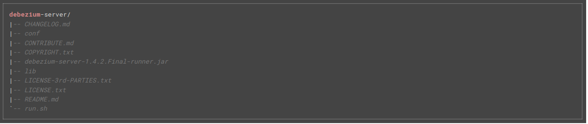

Debezium
-----
En este documento tenemos varias versiones de debezium, pero en esta primera parte vamos a explicar la instalación del debezium original. 

En esta configuración lo que hacemos es conectar el debezium contra nuestra base de datos y subiéremos las tablas a pub/sub con google cloud. 

Para la descarga del mismo vamos a la propia web https://debezium.io y descargamos la versión 1.4 , también podemos descargarlo del siguiente enlace [link](https://repo1.maven.org/maven2/io/debezium/debezium-server-dist/1.4.2.Final/debezium-server-dist-1.4.2.Final.tar.gz).

Para usarlo debemos tener instalado java en nuestro equipo (el openjdk nos vale perfectamente)

Una vez lo descomprimamos, tenemos la siguiente estructura: 


En este caso tendríamos ir a carpeta conf y generar el fichero application.properties, podemos usar el de ejemplo que nos trae, la configuración seria la siguiente (ojo, este seria para postgres):

```
debezium.sink.type=pubsub # Aqui se le indica a donde enviamos los datos, en nuestro caso google cloud con pub/sub
debezium.sink.pubsub.project.id=formacion-303709 # aqui seria el proyecto de google cloud 
debezium.source.connector.class=io.debezium.connector.postgresql.PostgresConnector # el conector a la base de datos
debezium.source.offset.storage.file.filename=data/offsets.dat # este fichero es donde se guarda el id del snapshot que tomamos. 
debezium.source.offset.flush.interval.ms=0
# a partir de aqui son los datos de la  base de datos
debezium.source.database.hostname=localhost
debezium.source.database.port=5432
debezium.source.database.user=postgres
debezium.source.database.password=postgres
debezium.source.database.dbname=postgres
#el siguiente parametro es el nombre que le damos a la base de datos, del siguiente se generan los topics.
#quedando del estilo $(server.name).$(dbname).$(include.list)
debezium.source.database.server.name=debezium # este dato es importante, es el nombre que le damos a la base de datos
debezium.source.schema.include.list=customers
```
Si queremos hacer pruebas en local, podemos levantar una base de datos de postgress con el siguiente comando en docker:
```
docker run -d --name postgres -p 5432:5432 -e POSTGRES_USER=postgres -e POSTGRES_PASSWORD=postgres  debezium/example-postgres
```
Es recomendable también levantar el pgadmin para poder modificar datos en el mismo:
```
docker run -p 8011:80 --name pgadmin  -e 'PGADMIN_DEFAULT_EMAIL=ruben.castrelo@prefapp.es'     -e 'PGADMIN_DEFAULT_PASSWORD=abc123.' --link postgres     -d dpage/pgadmin4
```

Una vez tenemos esto generado (base de datos activa, archivo de configuración del debezium) debemos hacer lo siguiente:

 1. Generar una cuenta de servicio en google cloud para nuestro debezium y darle permisos para (pendiente de revisión)
 
	 - BigQuery (admin)
	 - DataCatalog (admin)
	 - dataflow (admin)
	 - pub/sub (publisher)
 	 - pub/sub (editor)
 	 - storage object (admin )

 2. Generar el topic en pub/sub con los datos del debezium, recordemos $(server.name).$(dbname).$(include.list)
 3. Generar un subscritor al topic anterior.

Una vez tengamos todo lo anterior creado, nos descargamos las credenciales de google en formato json y exportamos la variable de entorno GOOGLE_APPLICATION_CREDENTIALS indicando la ruta al fichero anterior y ya podemos ejecutar el fichero `run.sh`, este lo que hace es ejecutar un java que hay en la misma carpeta, enviando asi todas los datos de la tabla a nuestro pub/sub. (debezium guarda el estado de la tabla en el fichero que configuramos en la configuración con `debezium.source.offset.storage.file.filename`, si nos cargamos este fichero vuelve a subir todo el contenido de la tabla). 

Recopilar los datos de pub/sub a una tabla en BQ:
---
Una opción viable que encontramos para poner los datos de nuestro pub/sub al bigquery seria usando la opción de "Pub/Sub to BigQuery" indicada en el siguiente enlace: 
https://github.com/GoogleCloudPlatform/DataflowTemplates

Para usarla tenemos que tener instalado en la máquina a desplegarla :
 - maven 3 
 - java 8
 
También tenemos que crear en google cloud un bucket para almacenar un javascript (UDF), el dataflow que ejecutaremos mas adelante y los temporales del mismo. 

Los pasos a seguir serian:

 1. Descargamos los datos del git `git clone https://github.com/GoogleCloudPlatform/DataflowTemplates`
 2. Descargamos las dependencias necesarias `mvn clean compile`
 3. Subimos el siguinete javascript a nuestro bucket (este relaciona los datos de nuestro pub/sub con las tablas de bigquery):
 ```
/**
 * A transform function
 * @param {string} inJson
 * @return {string} outJson
 */
function transform(inJson) {
    var inObj = JSON.parse(inJson);

    var obj = new Object();

    if ( (typeof inObj.payload.after !== 'undefined') && 
         (inObj.payload.after !== null) ){
        obj = inObj.payload.after;
    }else{
        if ( (typeof inObj.payload.before !== 'undefined') && 
            (inObj.payload.before !== null) ){
            obj = inObj.payload.before; 
        }
    }

    var jsonString = JSON.stringify(obj);

    return jsonString;
}
```
4.Modificamos el siguiente codigo y lo ejecutamos para subir nuestro dataflow a nuestro bucket:
```
PROJECT_ID=formacion-303709
BUCKET_NAME=debezium
PIPELINE_FOLDER=gs://${BUCKET_NAME}/dataflow/pipelines/pubsub-to-bigquery
USE_SUBSCRIPTION=true
javascriptTextTransformGcsPath=gs://${BUCKET_NAME}/jtransform2.js
javascriptTextTransformFunctionName=transform
RUNNER=DataflowRunner

mvn compile exec:java \
  -Dexec.mainClass=com.google.cloud.teleport.templates.PubSubToBigQuery \
  -Dexec.cleanupDaemonThreads=false \
  -Dexec.args=" \
  --project=${PROJECT_ID} \
  --stagingLocation=${PIPELINE_FOLDER}/staging \
  --tempLocation=${PIPELINE_FOLDER}/temp \
  --templateLocation=${PIPELINE_FOLDER}/template \
  --runner=${RUNNER} \
  --javascriptTextTransformGcsPath=${javascriptTextTransformGcsPath} \
  --javascriptTextTransformFunctionName=${javascriptTextTransformFunctionName} \
  --useSubscription=${USE_SUBSCRIPTION} \
  --region=europe-west2-a "
```

5. Ejecutamos nuestro runner de dataflow . 
```
PROJECT_ID=formacion-303709
JOB_NAME=pubsub-to-bigquery-`date +"%Y%m%d-%H%M%S%z"`
BUCKET_NAME=debezium
PIPELINE_FOLDER=gs://${BUCKET_NAME}/dataflow/pipelines/pubsub-to-bigquery
SUBSCRIPTION=projects/formacion-303709/subscriptions/lector
TABLEBQ=bqventas.clientes
LOCATIONJS=gs://{BUCKET_NAME}/jtransform2.js

gcloud dataflow jobs run ${JOB_NAME} \
--gcs-location=${PIPELINE_FOLDER}/template \
--region=europe-west2 \
--parameters   "inputSubscription=${SUBSCRIPTION},outputTableSpec=${PROJECT_ID}:${TABLEBQ},javascriptTextTransformGcsPath=${LOCATIONJS},javascriptTextTransformFunctionName=transform"
```
Y listo, ya tendriamos un runner de dataflow copiando los datos que se envian a pub/sub a nuesta tabla. 
